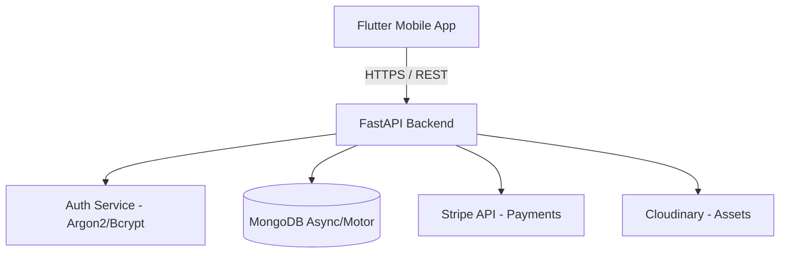

<div align="center">
  
# 📍 NearMe

**A Hyper-Local Service Marketplace Ecosystem**

[](https://flutter.dev/)
[](https://fastapi.tiangolo.com/)
[](https://www.mongodb.com/)
[](https://stripe.com/)
[](https://cloudinary.com/)

An all-in-one digital platform bridging the gap between local talent and customer needs. 
Find, book, and pay for services right in your neighborhood.

---

</div>

## 📖 About The Project

**NearMe** is a full-stack, cross-platform application designed to revolutionize how local services are discovered and rendered. Built with a high-performance **FastAPI** backend and a reactive **Flutter** mobile client, the platform caters to three distinct roles:
1. **Customers:** Discover and book local service providers via interactive maps.
2. **Freelancers:** Monetize skills by publishing "Gigs", communicating with clients, and tracking earnings.
3. **Administrators:** Oversee platform integrity, moderate listings, and monitor global analytics.

---

## ✨ Core Features

### 🔍 Discovery & Geolocation
*   **Proximity Search:** Built-in `flutter_map` and `geolocator` integrations allow users to discover gigs nearby.
*   **Smart Recommendations:** Backend matching algorithms recommend services based on user patterns and location.

### 💼 Gig & Order Management
*   **Service Listings (Gigs):** Freelancers can post detailed service offerings with images hosted via **Cloudinary**.
*   **Order Lifecycle:** Complete booking flow from request tracking to final approval.
*   **Task Queueing:** Background acceptance queues built in the Python backend handle concurrency seamlessly.

### 💬 Real-Time Communication
*   **Integrated Chat:** Secure, fast in-app messaging system connecting clients to service providers.
*   **Inbox Dashboard:** Organized thread views for customer support and gig queries.

### 💳 Secure Transactions
*   **Stripe Integration:** End-to-end payment processing for gig bookings and automated payouts.
*   **Analytics & Earnings:** Freelancers can track their incoming revenue, while Admins view overall platform traffic.

---

## 🏗️ Technical Architecture

The platform follows a scalable client-server architecture.



### Tech Stack

| Layer | Technologies Used |
| :--- | :--- |
| **Frontend Framework** | Flutter (Dart `^3.11.0`) |
| **State Management** | Riverpod (`flutter_riverpod`) |
| **HTTP Client (App)** | Dio |
| **Backend Framework** | FastAPI (Python 3.10+) |
| **Database** | MongoDB (Motor Async Driver) |
| **Authentication** | JWT (JSON Web Tokens), `passlib` |
| **3rd Party Services** | Stripe (Finance), Cloudinary (Images) |

---

## 📂 Project Structure

```text
near_me/
├── lib/
│   ├── Frontend/               # Global UI Components & Screens
│   │   ├── Admin/              # Admin Moderation & Analytics Views
│   │   ├── Features/           # Core User Features
│   │   │   ├── Auth/           # Login, Signup, Identity
│   │   │   ├── Chat/           # Real-time Messaging
│   │   │   ├── Gigs/           # Listing Browsing & Creation
│   │   │   ├── Orders/         # Order Tracking
│   │   │   └── Search/         # Map & Proximity Search
│   ├── backend/app/            # 🐍 Python FastAPI Master Source Code
│   │   ├── routes/             # API Endpoints (Auth, Gig, Orders, Media)
│   │   ├── models/             # PyDantic & MongoDB schemas
│   │   ├── core/               # Security & DB Init
│   │   └── Service/            # Business Logic Layers
│   └── core/                   # Shared Dart configurations, Themes, Utils
├── assets/                     # Local Fonts, Images, and .env files
└── pubspec.yaml                # Flutter Dependencies
```

---

## 🚦 Getting Started

Follow these steps to set up the project locally.

### Prerequisites
*   [Flutter SDK](https://docs.flutter.dev/get-started/install) 
*   [Python 3.10+](https://www.python.org/downloads/)
*   Local or Atlas [MongoDB Database](https://www.mongodb.com/)

### 1. Environment Configuration
Create a `.env` file in `lib/backend/app/` (and ensure your Flutter instance resolves these variables):
```env
MONGO_URL=mongodb+srv://<user>:<password>@cluster.mongodb.net/
DB_NAME=nearme_db
SECRET_KEY=your_super_secret_jwt_key
ALGORITHM=HS256
ACCESS_TOKEN_EXPIRE_MINUTES=1440
STRIPE_SECRET_KEY=sk_test_...
CLOUDINARY_CLOUD_NAME=your_cloud_name
CLOUDINARY_API_KEY=your_api_key
CLOUDINARY_API_SECRET=your_api_secret
```

### 2. Backend Initialization (FastAPI)
Launch the server to allow the app to communicate:
```bash
# 1. Navigate to the backend directory
cd lib/backend/app

# 2. Create and activate a Virtual Environment
python -m venv venv
source venv/bin/activate      # Mac/Linux
.\venv\Scripts\activate       # Windows

# 3. Install requirements
pip install -r requirements.txt

# 4. Start the Application
uvicorn main:app --reload --host 0.0.0.0 --port 8000
```
> **Tip:** Visit `http://localhost:8000/docs` to view the auto-generated Swagger API documentation.

### 3. Frontend Initialization (Flutter)
Open a **new terminal tab** in the project root (`near_me/`):
```bash
# 1. Fetch Flutter dependencies
flutter pub get

# 2. Run the application
flutter run
```

---

## 🔌 Core API Services

The FastAPI backend exposes several optimized modular routes:
* `/auth` - Registration, JWT generation, Role assignment.
* `/gigs` - CRUD for service listings, geospatial indexing.
* `/orders` - Payment initialization, order lifecycle updates.
* `/chat` - Thread creation and messaging histories.
* `/media` - Secure uploads to Cloudinary.
* `/recommend` - Smart gig recommendations based on user profiles.
* `/analytics` - System metrics for Admin dashboards.

---

## 🤝 Project Credits
Developed as part of the SP25-BCS-048 curriculum. 

**Author:** Haseeb
**Version:** 1.0.0