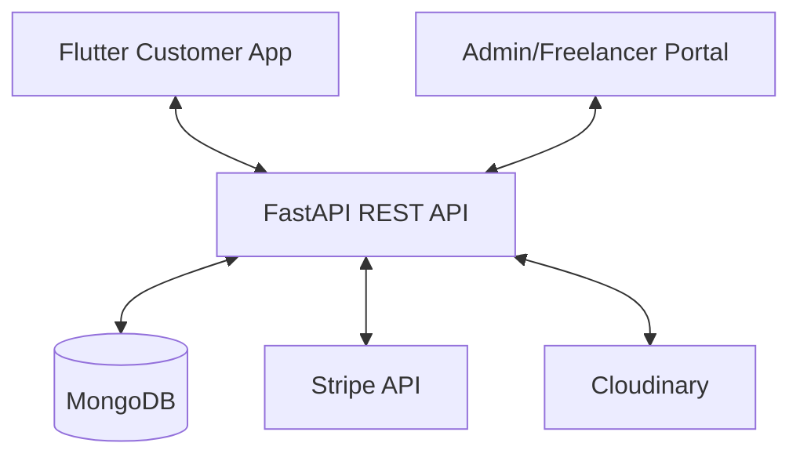

# NearMe: Complete Local Service Marketplace Ecosystem

NearMe is a comprehensive, full-stack platform designed to connect customers with local service providers (freelancers) through a feature-rich digital marketplace. This repository contains the entire ecosystem, including the customer mobile application, administrative/freelancer dashboards, and the core FastAPI backend.

---

## 📖 Table of Contents
- [Core Features](#-core-features)
- [Architecture & Tech Stack](#-architecture--tech-stack)
- [Project Structure](#-project-structure)
- [Getting Started](#-getting-started)
  - [Backend Setup](#1-backend-setup)
  - [Customer App Setup](#2-customer-app-setup)
  - [Admin & Freelancer Module](#3-admin--freelancer-module)
- [Environment Configuration](#-environment-configuration)
- [API Documentation](#-api-documentation)

---

## 🚀 Core Features

### 👤 Role-Based Workflows
*   **Customers:** Discover local services via maps, book gigs, pay securely, and chat with providers.
*   **Freelancers:** Create service listings (gigs), manage orders, track earnings, and message clients.
*   **Administrators:** Moderate gigs, manage users, and oversee system-wide financial transactions.

### 🛠️ Key Functionalities
*   **Geospatial Discovery:** Real-time GPS location integration and interactive maps (`flutter_map`) to find services nearby.
*   **Order Management:** A robust lifecycle including an `AcceptanceQueue` for handling service requests.
*   **Real-time Interaction:** Integrated chat system for instant communication.
*   **Secure Payments:** Full Stripe integration for processing service fees and managing payouts.
*   **Media Hosting:** Cloudinary integration for high-performance image and asset management.

---

## 🏗️ Architecture & Tech Stack

### System Overview


### Technology Breakdown
| Layer | Technologies |
| :--- | :--- |
| **Mobile Frontend** | **Flutter** (Dart), Riverpod (State Management), Dio (Networking) |
| **Backend API** | **FastAPI** (Python 3.10+), Uvicorn (ASGI Server) |
| **Database** | **MongoDB** (Async with Motor driver) |
| **Auth/Security** | **JWT** (JSON Web Tokens), Argon2/Bcrypt Hashing |
| **Integrations** | **Stripe** (Payments), **Cloudinary** (Media), **Geolocator** (GNSS) |

---

## 📂 Project Structure

The project is organized into a single unified directory for both Frontend and Backend development:

- **Frontend (`lib/`)**:
    - `lib/Frontend/`: Contains all user interfaces.
        - `lib/Frontend/Features/`: Customer-facing screens and logic.
        - `lib/Frontend/Admin/`: Administrative dashboards and moderation tools.
    - `lib/core/`: Shared utilities, themes, and global constants.
- **Backend (`lib/backend/app/`)**:
    - The core FastAPI source code, including routes, models, and service logic.
- **Assets (`assets/`)**:
    - Image assets, fonts, and environment configurations.

---

## 🚦 Getting Started

### 1. Backend Setup (Core API)
The backend is located in `near_me/lib/backend/app`.

1.  **Navigate to directory:**
    ```powershell
    cd near_me/lib/backend/app
    ```
2.  **Initialize Environment:**
    ```powershell
    python -m venv venv
    .\venv\Scripts\activate  # Windows
    # source venv/bin/activate # Unix
    ```
3.  **Install Dependencies:**
    ```powershell
    pip install -r requirements.txt
    ```
4.  **Run with Uvicorn:**
    ```powershell
    uvicorn main:app --reload --host 0.0.0.0 --port 8000
    ```

### 2. Flutter App Setup (Customer & Admin)
The Flutter application is located in `near_me/` and serves all roles.

1.  **Navigate to directory:**
    ```bash
    cd near_me
    ```

2.  **Install Flutter Packages:**
    ```bash
    flutter pub get
    ```

3.  **Execution:**
    ```bash
    flutter run
    ```

---

## 🔑 Environment Configuration

A `.env` file must be created in `near_me/lib/backend/app/` (and updated in `near_me/assets/.env` for the Flutter app) with the following parameters:

| Variable | Description |
| :--- | :--- |
| `MONGO_URL` | Your MongoDB connection string. |
| `DB_NAME` | Name of your database (e.g., `near_me_db`). |
| `SECRET_KEY` | HS256 Secret for JWT generation. |
| `STRIPE_SECRET_KEY` | Your Stripe API secret key. |
| `CLOUDINARY_URL` | Cloudinary connection string for media assets. |

---

## 🛡️ Development & License

- **Project ID:** SP25-BCS-048 (Haseeb)
- **Status:** Active Development
- **Documentation:** For API endpoints, visit `http://localhost:8000/docs` while the backend is running.

---
© 2026 NearMe - Connecting Communities through Digital Service Innovation.

